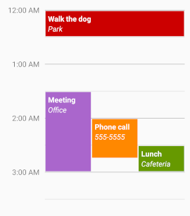

Tachyon
========

An Android library that provides a customizable calendar day view.



Getting Started
---------------

Clone or download this repo, then build the library project from the root directory:
```bash
./gradlew :tachyon:assemble
```

The compiled aar file should be in:
```bash
tachyon/build/outputs/aar/
```

Add the compiled aar library as a dependency in your project:\
https://developer.android.com/studio/projects/android-library#AddDependency

Overview
--------

Tachyon is designed to provide a familiar visualization of a calendar day. The rendering is done by the `DayView` class, which takes a list of events and displays them using a custom layout algorithm.

Usage
-----

To use Tachyon, you can either directly reference the `DayView` class in your layout files/code, or you can subclass `DayView` to customize the experience.

Sample App
----------

The ''tachyon-sample'' app contains an example of using the library.

Testing
-------

We use Mockito for our unit tests. You can run them via the `gradle clean test` command.
